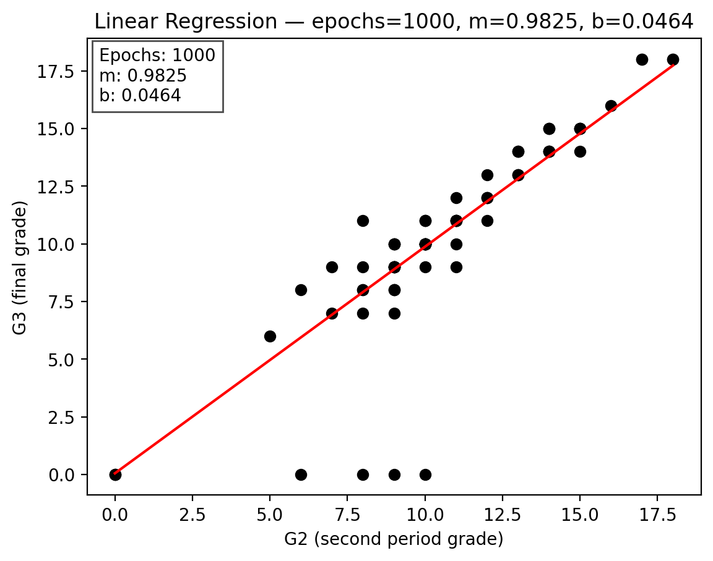

# Linear Regression from Scratch

This project implements a basic linear regression model entirely from first principles. It demonstrates how to train a model using gradient descent and evaluate its performance without relying on high-level machine learning libraries.

## Features
- Gradient descent optimisation
- Mean Squared Error and R² metrics
- Training/test split for evaluation
- Plotting of regression results

## Installation
Install the dependencies with:

```bash
pip install -r requirement.txt
```

## Usage
Run the training script:

```bash
python src/regression.py
```

The script prints training statistics and saves a plot of the fitted line to the `outputs/` directory.

## Results
Example regression output after training:



## Future Work
- Support for multivariate regression
- Regularisation to reduce overfitting
- Additional visualisation options

Contributions and suggestions are welcome.
